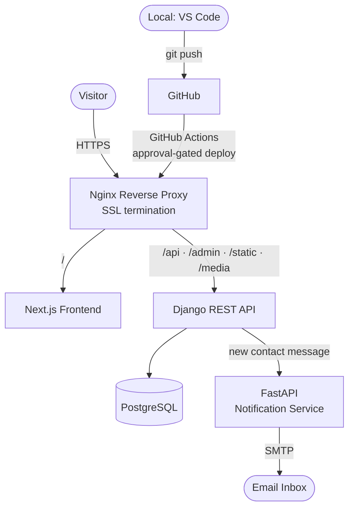
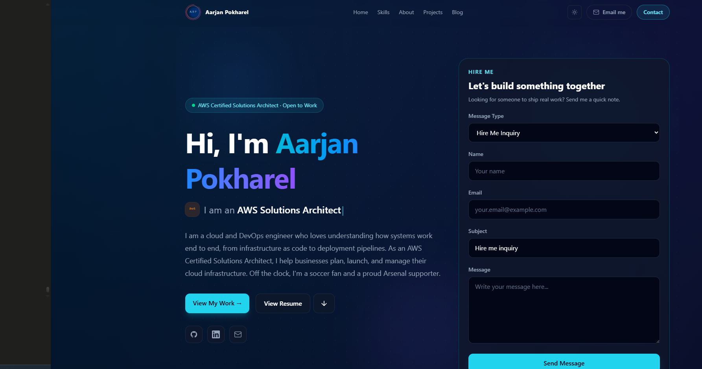
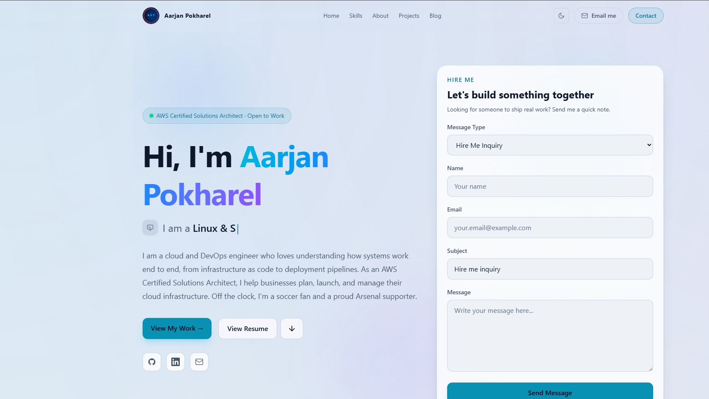
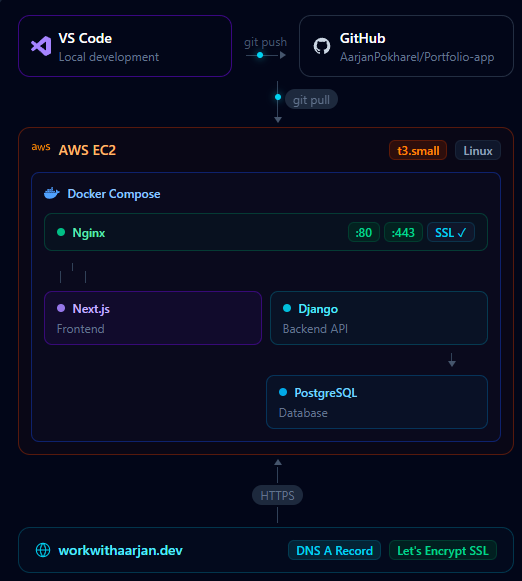
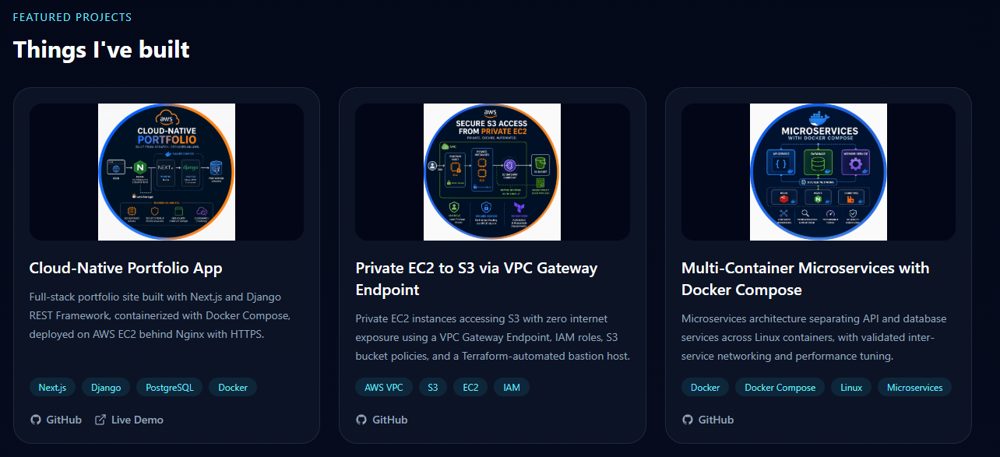

# Portfolio App

[](https://github.com/AarjanPokharel/Portfolio-app/actions/workflows/deploy.yml)

A cloud-native personal portfolio, built and deployed end to end as a production system — not a static page.

🔗 **Live:** [workwithaarjan.dev](https://workwithaarjan.dev)

The site itself is the smallest part of the project. The goal was to practice real-world software delivery: a decoupled frontend/backend, a separate microservice, containerized services, a reverse proxy with HTTPS, and an automated CI/CD pipeline.

---

## Architecture



All services run as containers on a single AWS EC2 instance, orchestrated with Docker Compose on a private Docker network. Only Nginx is exposed to the internet (ports 80/443); the backend, frontend, database, and notification service are reachable only internally.

---

## Screenshots

> Place images in `docs/screenshots/` and they'll render below.

| Home (dark) | Home (light) |
|-------------|--------------|
|  |  |

| Architecture diagram | Projects |
|----------------------|----------|
|  |  |

---

## Tech stack

| Layer | Technology |
|-------|-----------|
| **Frontend** | Next.js (App Router), Tailwind CSS, light/dark theming |
| **Backend** | Django REST Framework |
| **Database** | PostgreSQL |
| **Microservice** | FastAPI (email notifications) |
| **Reverse proxy** | Nginx + HTTPS via Let's Encrypt (Certbot) |
| **Containerization** | Docker, Docker Compose |
| **Hosting** | AWS EC2 |
| **CI/CD** | GitHub Actions (approval-gated SSH deploy) |

---

## Features

- **Fully backend-driven content** — profile, projects, skills, experience, education, stats, services, leadership/community, blog posts, and About photos are all managed through the Django admin; the frontend renders whatever the API returns.
- **Light / dark theme** toggle with no-flash SSR and persisted preference.
- **Animated, responsive architecture diagram** built in code (not an image), with live data-flow animation.
- **Contact form → FastAPI notification service** — submissions are stored in PostgreSQL and trigger an email notification, sent asynchronously so the request never blocks.
- **HEIC auto-conversion** for uploaded photos.
- **Automated deployments** — push to `main`, approve in GitHub Actions, and the pipeline pulls, rebuilds, migrates, and restarts services on the server.

---

## Repository structure

```
.
├── backend/                 # Django REST Framework API
│   ├── apps/
│   │   ├── portfolio/       # profile, projects, skills, experience, etc.
│   │   ├── blog/            # blog posts
│   │   ├── contact/         # contact messages + notification trigger
│   │   └── core/            # health check, root
│   ├── config/              # settings, urls, wsgi/asgi
│   └── Dockerfile
├── frontend/                # Next.js application
│   └── src/
│       ├── app/             # pages (App Router)
│       ├── components/      # UI components
│       └── lib/api.ts       # typed API client
├── notification-service/    # FastAPI microservice
│   └── app/
│       ├── routers/         # /notify/contact
│       ├── services/        # SMTP email sending
│       ├── schemas/         # Pydantic models
│       └── core/            # config + internal auth
├── nginx/                   # reverse proxy config
├── .github/workflows/       # CI/CD pipeline (deploy.yml)
└── compose.yaml             # Docker Compose orchestration
```

---

## Running locally

### Prerequisites
- Docker and Docker Compose

### 1. Create a `.env` file in the project root

```env
# Django
SECRET_KEY=your-django-secret-key
DEBUG=True
ALLOWED_HOSTS=localhost,127.0.0.1,backend
CORS_ALLOWED_ORIGINS=http://localhost:3000
CSRF_TRUSTED_ORIGINS=http://localhost:3000

# PostgreSQL
POSTGRES_DB=arp_db
POSTGRES_USER=arp_user
POSTGRES_PASSWORD=arp_password

# Frontend
NEXT_PUBLIC_API_BASE_URL=http://localhost:8000

# Django <-> FastAPI shared secret
INTERNAL_API_TOKEN=any-long-random-string

# Notification service (SMTP)
SMTP_HOST=smtp.gmail.com
SMTP_PORT=587
SMTP_USER=your_email@gmail.com
SMTP_PASSWORD=your_app_password
SMTP_FROM=your_email@gmail.com
SMTP_USE_TLS=true
SMTP_USE_SSL=false
NOTIFY_TO_EMAIL=your_email@example.com
```

### 2. Build and start

```bash
docker compose up -d --build
```

### 3. Apply migrations and create an admin user

```bash
docker compose exec backend python manage.py migrate
docker compose exec backend python manage.py createsuperuser
```

### 4. Open

- Frontend: http://localhost:3000
- API: http://localhost:8000/api/
- Admin: http://localhost:8000/admin/

---

## Deployment

The app runs on AWS EC2 with Docker Compose. Nginx terminates SSL (Let's Encrypt) and proxies to the frontend and backend; media and static files are served directly by Nginx.

Deployments are automated via **GitHub Actions** (`.github/workflows/deploy.yml`):

1. Push to `main`
2. The pipeline runs sanity checks
3. The deploy job **pauses for manual approval** (GitHub Environments)
4. On approval, it SSHes into EC2, pulls the latest code, rebuilds the containers, runs migrations, collects static files, and reloads Nginx

---

## License

© Aarjan Pokharel. All rights reserved.
